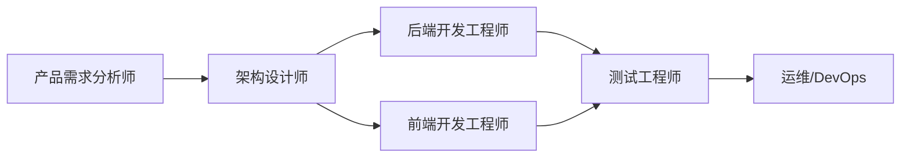

# Agent 角色定义参考

## 常见场景与角色映射

### 系统 / 产品开发

| 角色 id | 显示名 | 职责概要 | 主要产出 |
|---------|--------|----------|----------|
| product-analyst | 产品需求分析师 | 收集与澄清需求、编写 PRD、定义验收标准 | PRD、用户故事、验收清单、原型说明 |
| architect | 架构设计师 | 技术选型、模块划分、接口与数据模型设计 | 架构图、技术方案、API 契约、数据模型 |
| backend-engineer | 后端开发工程师 | 接口实现、领域逻辑、数据持久化与集成 | 代码、API 文档、数据模型说明、迁移脚本 |
| frontend-engineer | 前端开发工程师 | 页面与交互、状态与联调、性能与可访问性 | 页面/组件、交互说明、联调清单 |
| qa-engineer | 测试工程师 | 用例设计、自动化与回归、缺陷跟踪 | 测试用例、测试报告、缺陷列表 |
| devops-engineer | 运维/DevOps 工程师 | 部署、CI/CD、监控与发布流程 | 部署文档、流水线配置、运维手册 |

### 数据分析与算法

| 角色 id | 显示名 | 职责概要 | 主要产出 |
|---------|--------|----------|----------|
| data-analyst | 数据分析师 | 指标定义、取数与清洗、报表与看板 | 指标文档、SQL/脚本、报表与看板 |
| ml-engineer | 算法/ML 工程师 | 特征与模型设计、训练与评估、上线方案 | 特征文档、模型说明、评估报告、服务接口 |
| data-engineer | 数据工程师 | 数仓与管道、质量与治理 | 管道代码、数据模型、质量规则 |

### 运维与 SRE

| 角色 id | 显示名 | 职责概要 | 主要产出 |
|---------|--------|----------|----------|
| sre-engineer | SRE 工程师 | 可用性、容量与故障处理、自动化与演练 | 运行手册、预案、容量报告、自动化脚本 |
| security-engineer | 安全工程师 | 安全评审、漏洞与合规、加固与响应 | 评审结论、加固清单、事件报告 |

### 产品与需求（轻量）

| 角色 id | 显示名 | 职责概要 | 主要产出 |
|---------|--------|----------|----------|
| product-owner | 产品负责人 | 优先级、范围与验收、干系人对齐 | 需求清单、迭代范围、验收标准 |
| ux-writer | 体验/文案 | 文案与交互文案、一致性 | 文案规范、页面文案、组件说明 |

### 全栈小团队（合并角色）

| 角色 id | 显示名 | 职责概要 | 主要产出 |
|---------|--------|----------|----------|
| fullstack-developer | 全栈开发 | 端到端功能实现、接口与简单部署 | 前后端代码、API、部署说明 |
| tech-lead | 技术负责人 | 方案评审、规范与排期、技术债务 | 技术决策记录、规范文档、排期 |

---

## 角色定义结构说明

每个角色建议包含以下字段（与 `assets/role-template.json` 一致）：

| 字段 | 类型 | 说明 |
|------|------|------|
| id | string | 唯一标识，小写连字符，如 `backend-engineer` |
| displayName | string | 中文或产品内显示名称 |
| scenario | string | 所属场景，如 `system-development`、`data-analysis` |
| scope | string | 职责范围与边界；明确「不负责」的事项 |
| inputExpectation | object | 期望的输入：upstreamRoles、artifacts、requiredFormat |
| constraints | string[] | 必须遵守的规范（命名、安全、性能、分支等） |
| outputSpec | object | 产出物：artifacts（名称与格式）、qualityCriteria、templateRef |
| handoff | object | 交接：targetRoles、format（文档/分支/工单）、checklist |
| metadata | object | 可选：version、tags、owner |

---

## 输出规范通用约定

### 文档类产出

- 格式：Markdown，标题层级清晰，代码块标明语言
- 必备节：目的、范围、输入/前置条件、输出/交付物、约束与假设、变更记录（若为正式文档）
- 命名：`<角色-id>_<产出类型>_<简短描述>.md`，如 `backend-engineer_api_spec.md`

### 配置/契约类产出

- API：OpenAPI 3.x 或等价结构；含 path、method、request/response、示例
- 数据模型：字段名、类型、必填、说明、示例值；可引用 JSON Schema

### 代码类产出

- 遵循项目既有目录与命名规范
- 含必要注释与 README；公开接口需文档或类型定义

---

## 角色依赖与顺序示例（系统开发）

可据此生成「阶段→角色→产出→下游」的交接清单，写入各角色的 `handoff`。
